# RoadIQ — Triple Riding: Status & Test Log

Status snapshot of the triple-riding detection pipeline (`app.py`, `image_service.py`, `triple_riding_service.py`, `rider_association.py`), current as of this test batch.

**Config used for all tests below:** Detector `YOLO26 Nano`, Pose `YOLO26 Pose Nano`, Detection confidence `0.35`, Rider association threshold `0.52`.

---

## Summary

| # | Riders visible | Riders detected | Status shown | Verdict |
|---|---|---|---|---|
| 1 | 4 | 4 (RIDER 3 at 174%) | CANDIDATE | Confidence overflow bug; not confirmed |
| 2 | 1–2 per bike | Correct | — | Correct (no violation present) |
| 3 | mixed, 1 bike has 2 | Correct | — | Correct, but label clutter |
| 4 | 1–2 per bike | Correct | PERSON NOT ASSOCIATED ×2 | Missed association |
| 5 | 1–2 per bike | Correct | PERSON NOT ASSOCIATED | Missed association |
| 6 | 1–2 per bike | Correct | — | Correct |
| 7 | 2 (same bike) | 1 | PERSON NOT ASSOCIATED | Missed association (false negative) |
| 8 | 4 | 4 (garbled %) | CANDIDATE | Real violation, not confirmed |
| 9 | 4 | 4 (174%) | CANDIDATE | Same case as #1, repeat capture |
| 10 | 2 | 2 | — | Correct |
| 11 | 2 | 2 | — | Correct |
| 12 | 4 | 4 | **Triple Riding = 1** | Correctly confirmed |
| 13 | 3 | 3 | CANDIDATE, duplicate label | Real violation, not confirmed + label bug |
| 14 | 2 rider + 1 pedestrian | 2 | PERSON NOT ASSOCIATED | Ambiguous — needs manual check |

Out of 5 frames with an actual 3+ rider motorcycle (1, 8, 9, 12, 13), only **#12** was confirmed as `Triple Riding`. The rest stayed at `CANDIDATE` and never converted.

---

## Recurring issues

1. **CANDIDATE never resolves to CONFIRMED on single images.** Frames 1, 8, 9, 13 all detect 3–4 riders on one motorcycle correctly but stay labeled `CANDIDATE` and the `Triple Riding` counter stays at 0. Only frame 12 converted. Candidate → confirmed likely requires the temporal confirmation step, which by design only runs on video — single-image inference may need its own confirmation path instead of inheriting the video-only gate.
2. **Confidence values exceeding 100%.** Frame 1/9 shows `RIDER 3 | 174%`. Confidence should be clamped to [0, 100].
3. **"PERSON | NOT ASSOCIATED" on riders who are clearly seated on a visible bike** (frames 4, 5, 7, 14). Frame 7 is the clearest case: two people are on the same motorcycle, tightly overlapping, but only one gets associated — the pillion rider is dropped, undercounting a 2-rider bike as 1. This points to the rider-association geometry/pose threshold being too strict when riders overlap heavily (motion blur in frame 7 likely compounds it).
4. **Overlapping/unreadable on-image labels** when multiple bikes are close together (frames 2, 3, 4, 13). Text for adjacent `BIKE n | RIDERS n` boxes stacks on top of each other. Cosmetic, but makes manual QA harder.
5. **Duplicate label rendering** in frame 13 — `PERSON 4 | NOT ASSOCIATED` is drawn twice at the same position.

---

## Per-image detail

### Test 1
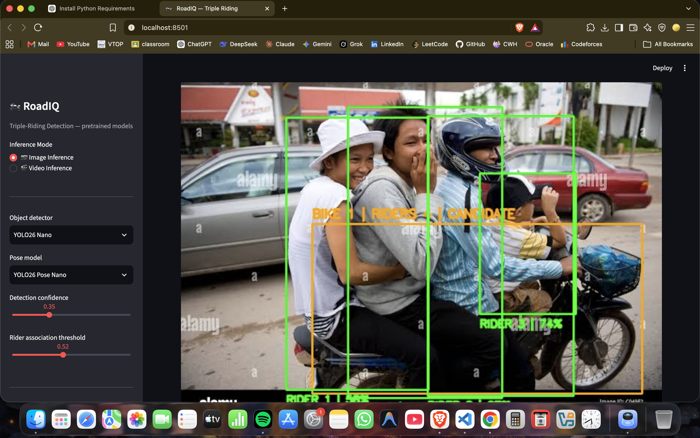

4 people clearly on one motorcycle. Detected as `BIKE 1 | RIDERS 4 | CANDIDATE`. `RIDER 3` shows `174%` confidence — value exceeds the valid 0–100% range. Never converts to a confirmed triple-riding event despite 4 riders being correctly counted.

### Test 2
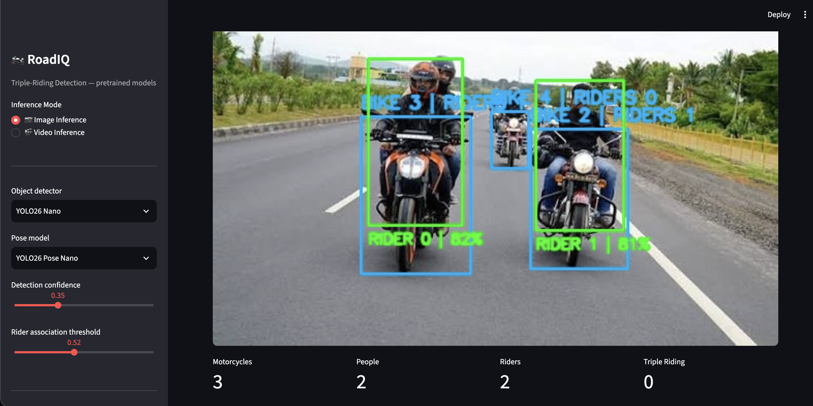

Three motorcycles, 1–2 riders each, no violation present. Rider counts are correct (`Motorcycles 3, People 2, Riders 2, Triple Riding 0`). Labels for `BIKE 3`, `BIKE 2`, `BIKE 4` overlap and are hard to read.

### Test 3
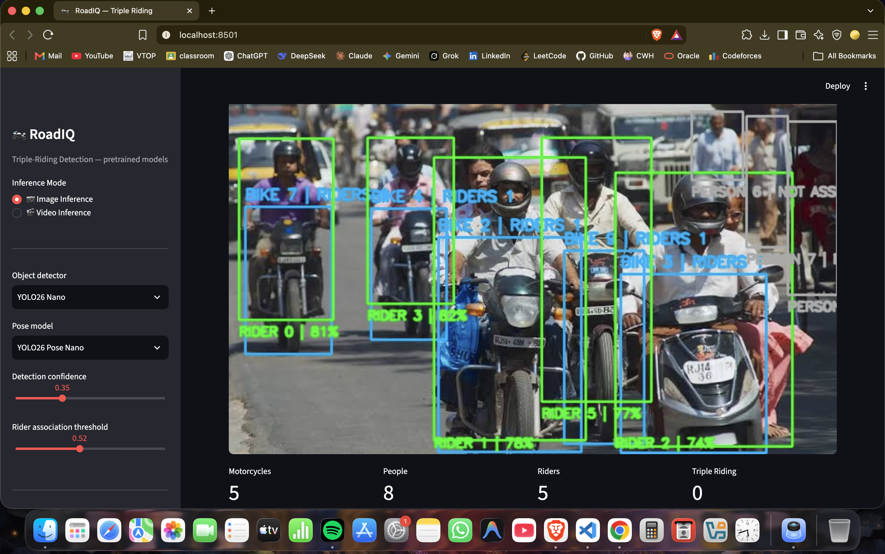

Dense street scene, 5 motorcycles, 8 people. Rider counts per bike (1, 1, 1, 1, 2) look correct and `Person 6` is correctly flagged as unassociated (pedestrian, no bike nearby). Label text is heavily overlapped across the cluster on the right.

### Test 4
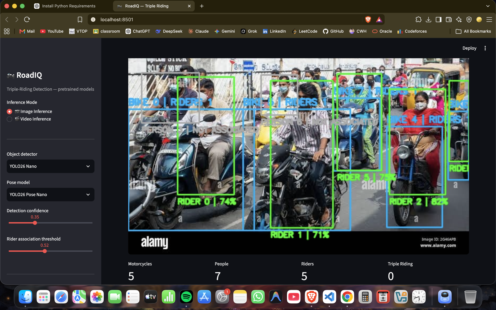

Five motorcycles in a crowd. Two people are marked `PERSON | NOT ASSOCIATED` even though they appear to be walking alongside/behind riders rather than on a bike — plausibly correct, but the grey boxes sit close enough to the bikes that it's worth a manual check. Label overlap on `BIKE 0/9` makes the rider count for those two illegible.

### Test 5
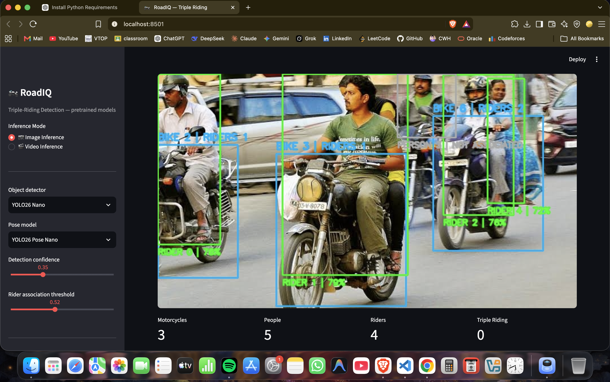

Three motorcycles. `BIKE 6 | RIDERS 2` is correct. One `PERSON | NOT ASSOCIATED` near bike 6 — same ambiguity as test 4, likely a pedestrian rather than a missed rider.

### Test 6
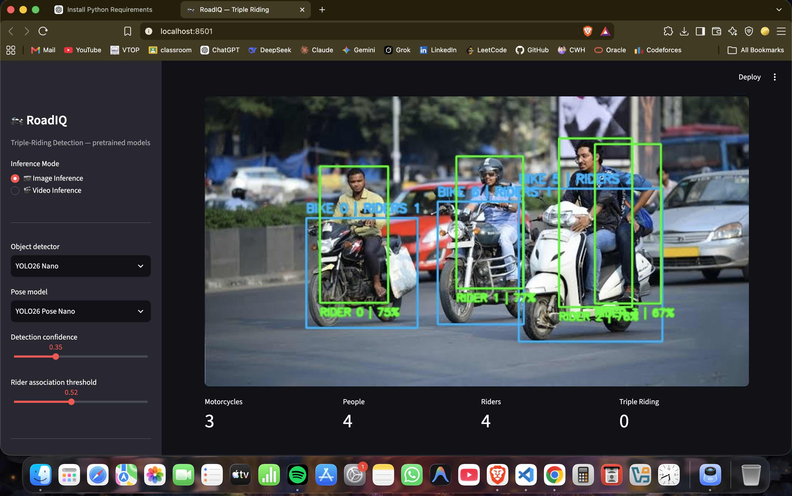

Three motorcycles/scooters, all 1–2 riders, correctly counted (`Motorcycles 3, People 4, Riders 4, Triple Riding 0`). No violation present. Labels for `BIKE 5/6` overlap.

### Test 7
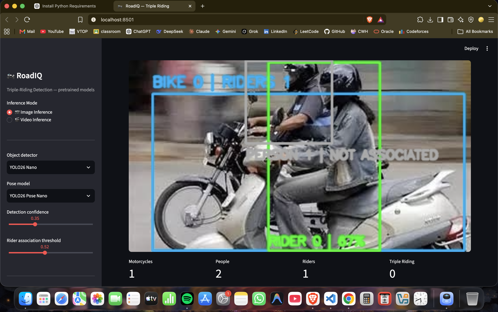

Blurry, motion-heavy frame. Two people clearly seated on the same motorcycle, but only the front rider is counted (`RIDER 0`); the pillion rider is labeled `PERSON | NOT ASSOCIATED`. Result: `Riders 1` when it should be `2`. This is a clear rider-association miss, likely because motion blur degrades the pose keypoints used for association.

### Test 8
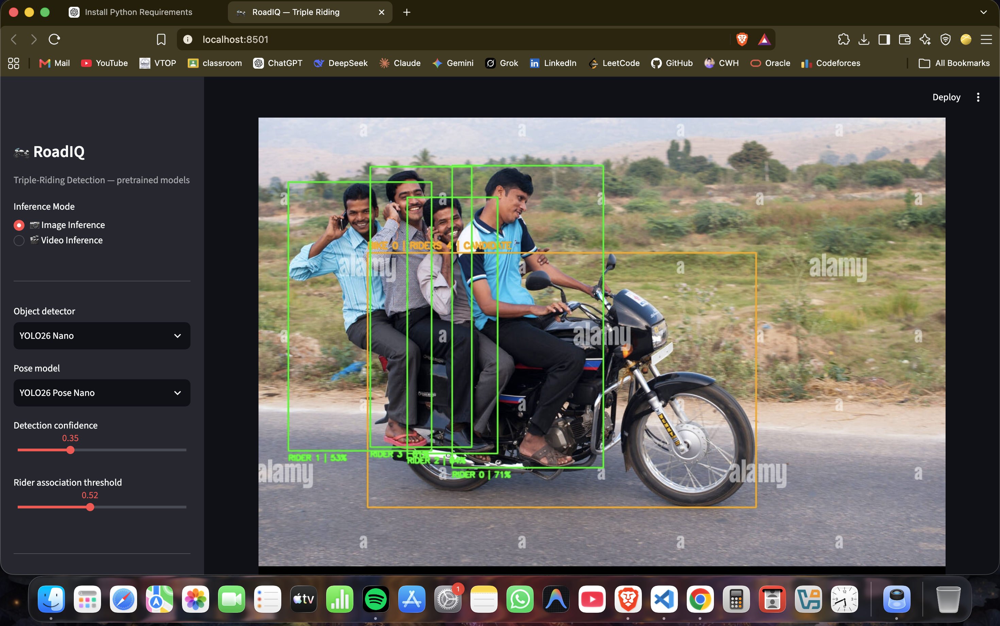

Four men on one motorcycle — an actual triple/quadruple-riding case. Detected as `BIKE 0 | RIDERS 4 | CANDIDATE`. Confidence labels for riders 1–3 are garbled/overlapping and partly unreadable. Never confirms as a triple-riding event.

### Test 9
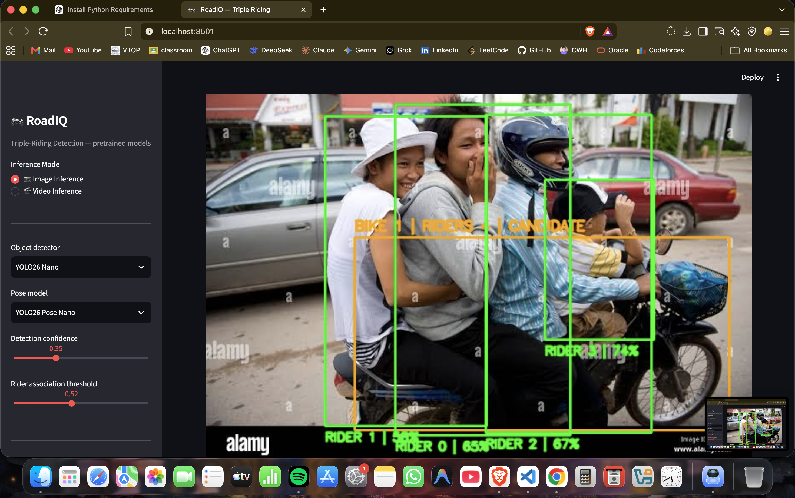

Same scene as Test 1, second capture (includes a thumbnail inset in the corner). Same result: `BIKE 1 | RIDERS 4 | CANDIDATE`, `RIDER 3 | 174%`. Confirms the confidence-overflow bug is reproducible, not a one-off.

### Test 10
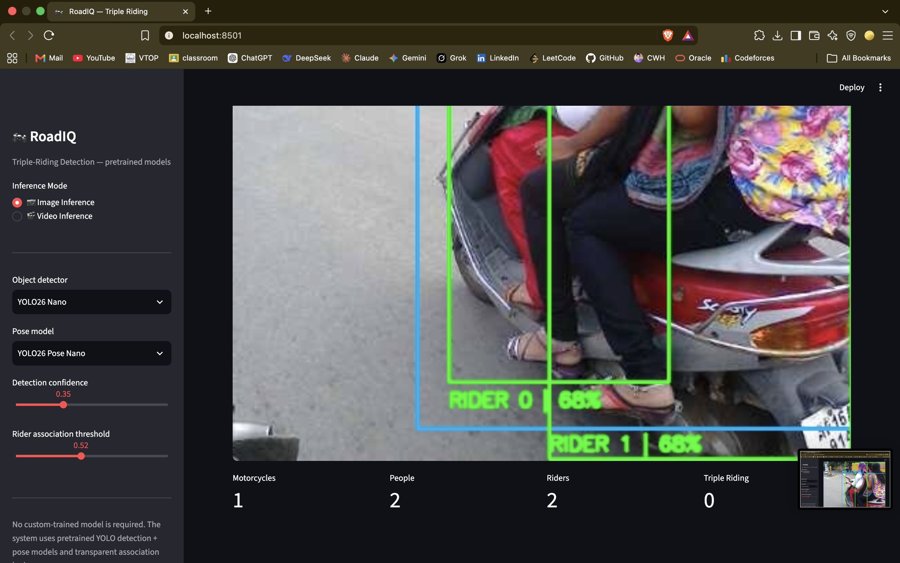

Close crop, two people on a scooter. Correctly detected as `Riders 2`, no violation. No errors observed.

### Test 11
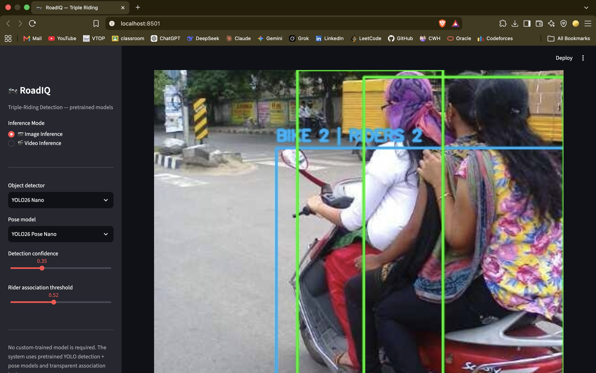

Two people on a scooter, correctly detected as `BIKE 2 | RIDERS 2`. No errors observed.

### Test 12
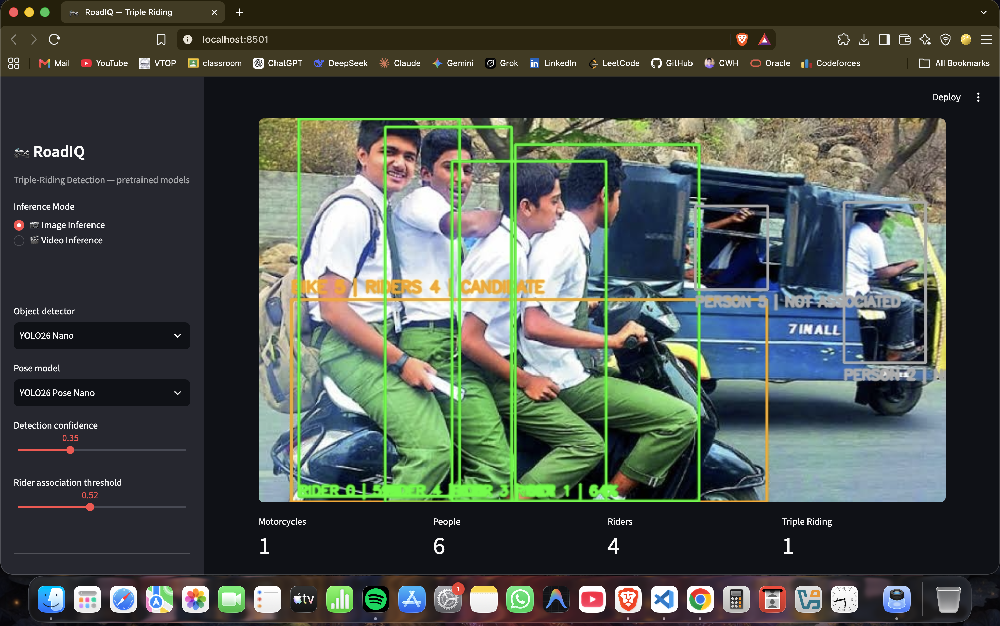

Four schoolboys on one scooter, with an auto-rickshaw in the background. Correctly detected as `BIKE 5 | RIDERS 4 | CANDIDATE`, and this is the **only test case where the counter shows `Triple Riding 1`** — i.e., the only frame where a real violation was actually confirmed rather than left at `CANDIDATE`. `Person 5` in the rickshaw is correctly excluded as not associated with the scooter.

### Test 13
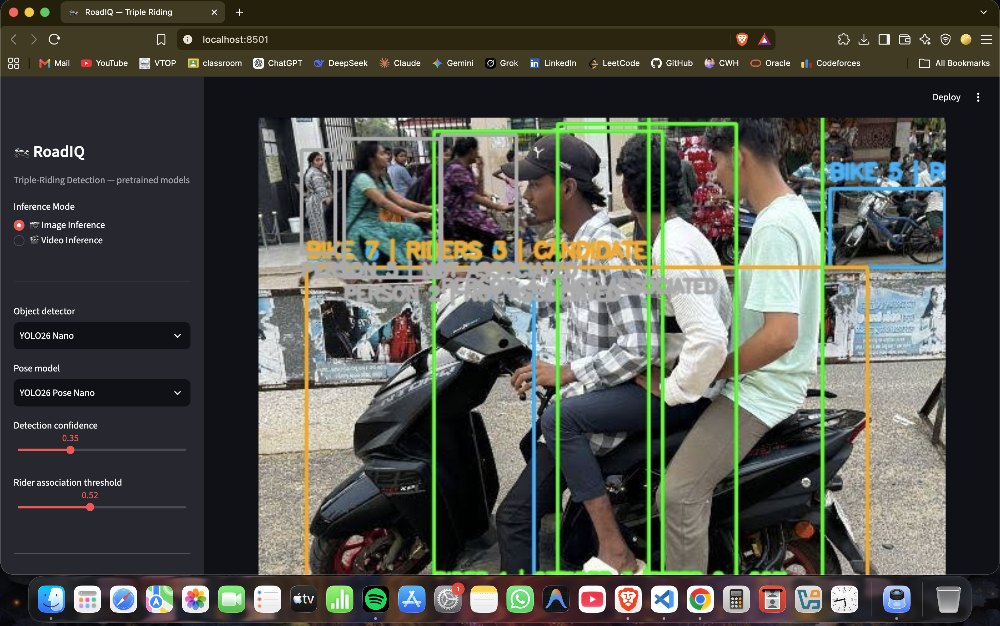

Three people on one scooter — a real violation. Detected as `BIKE 7 | RIDERS 3 | CANDIDATE`, but never confirms. `PERSON 4 | NOT ASSOCIATED` is rendered twice, stacked on the same position — a label-rendering duplication bug, not just overlap with another box.

### Test 14
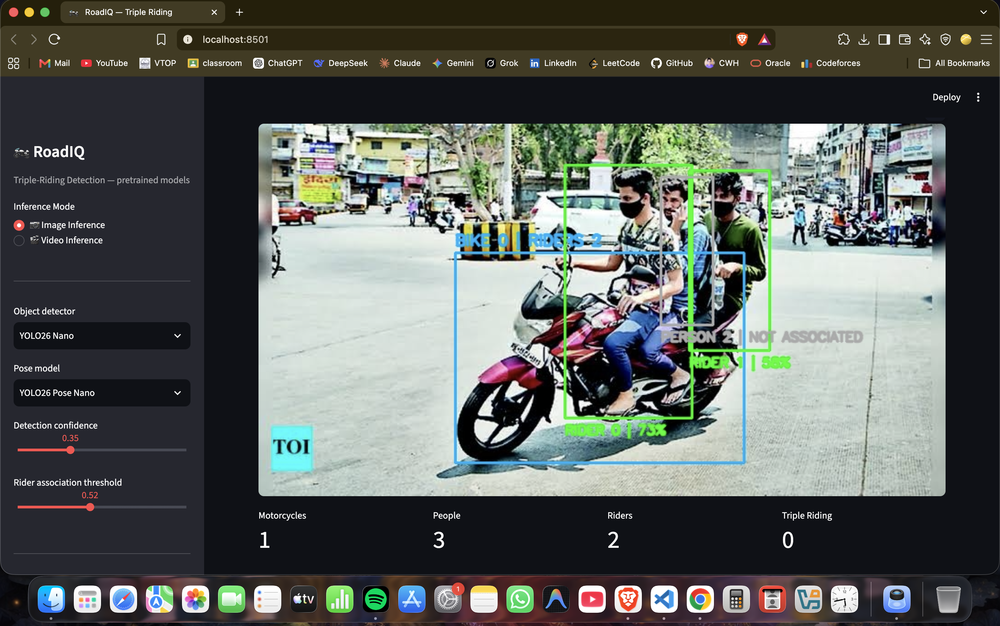

Two riders on a motorcycle plus a third person standing near it. Detected as `BIKE 0 | RIDERS 2`, third person `PERSON 2 | NOT ASSOCIATED`. Plausibly correct (pedestrian rather than rider), but worth a manual check since the person is close to the bike.

---

## Open items

- Fix confidence clamping (0–100%) in the rider-confidence display path.
- Investigate why `CANDIDATE → confirmed` only fired once (test 12) out of five genuine 3+ rider cases on single images — check whether temporal confirmation is unintentionally gating single-image results.
- Re-check rider-association scoring under motion blur / heavy overlap (test 7 undercount).
- Fix duplicate label rendering (test 13).
- Consider de-overlapping on-image text labels when bounding boxes are close together (tests 2, 3, 4, 13).
